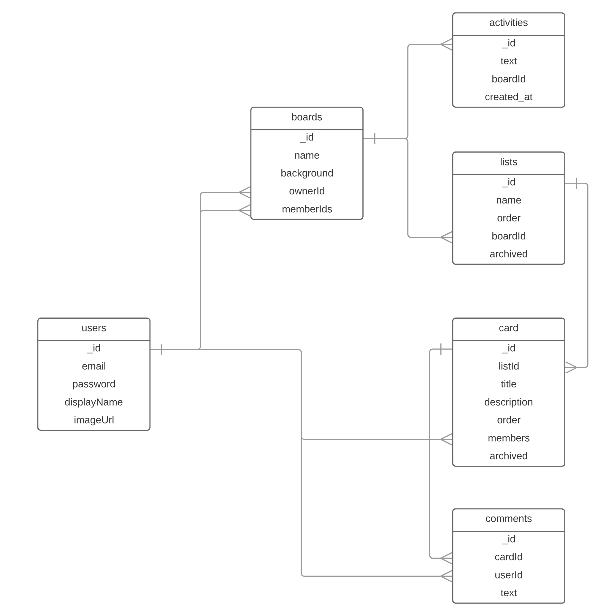

# Trello Clone

* [x] Generate Server
* [x] Generate Client
* [x] Add local auth to server
* [x] Add vuetify to client
* [x] Add feathers-vuex to client
* [x] Add login to client 
* [x] Add boards service to server
* [x] User can create/list/view boards on client
  * [x] Create
    * [x] Add ownerId
  * [x] List
    * [x] Restrict to owner
  * [x] View
    * [x] Restrict to owner
* [x] Add lists service to server
* [x] User can create/list/view lists for boards on client
  * [x] Create
    * [ ] Restrict to board owner
  * [x] List
    * [ ] Restrict to board owner
* [x] Store should update boards/lists when login/logout
* [x] Add cards service to server
* [ ] User can create/list/view cards for lists on client
  * [x] Create
    * [ ] Restrict to board owner
  * [x] List
    * [ ] Restrict to board owner
* [x] User can move cards from one list to another
* [ ] Restrict editing/creating lists/cards to board owner
  * [ ] Update to work for no boardId in query 
* [x] Create activities service on server
* [x] All activities are logged
* [ ] User can edit title of card
  * [ ] restrict to board members
* [ ] User can add description to a card
  * [ ] restrict to board members
* [ ] User can assign a member to a card
  * [ ] restrict to board members
* [ ] User can re-arrange cards in list
  * [ ] restrict to board members
* [ ] User can re-arrange lists
  * [ ] restrict to board members
* [ ] User can add comments to a card
  * [ ] restrict to board members

## Extra

* [ ] Move component state into the Vuex Store
* [ ] Refactor large components into many smaller components
* [ ] Make it look prettier

